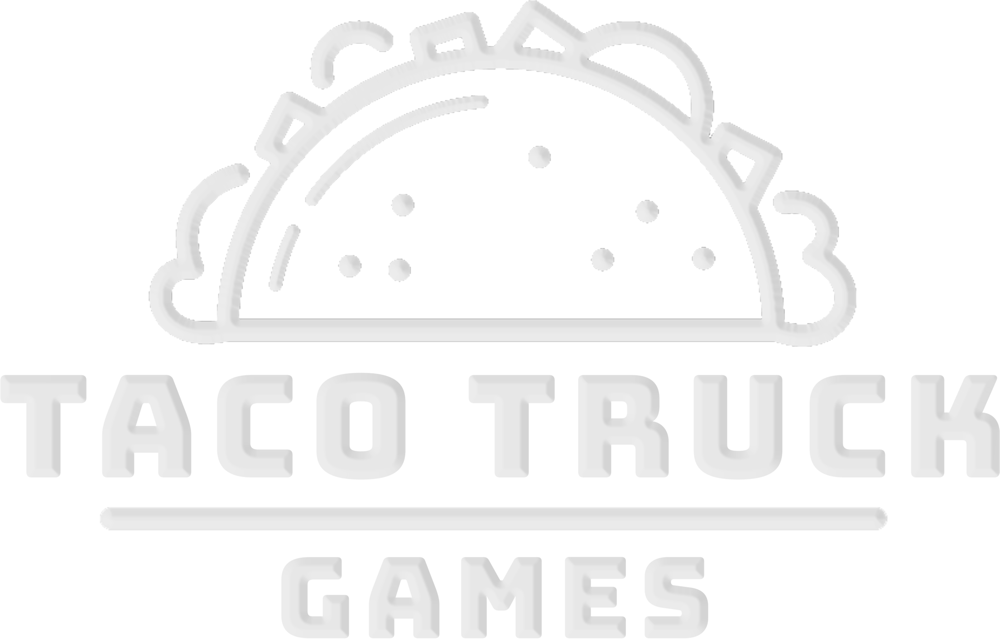
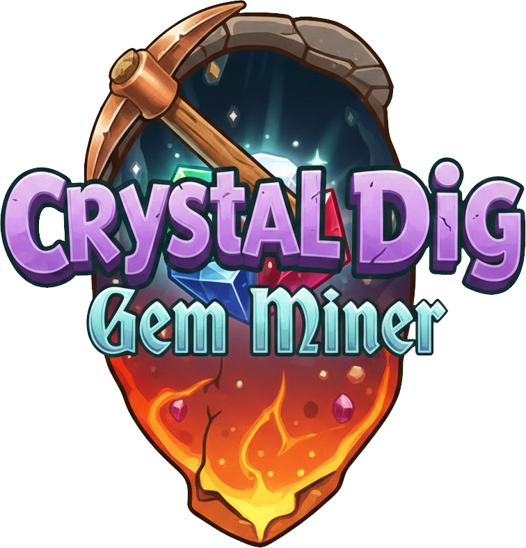
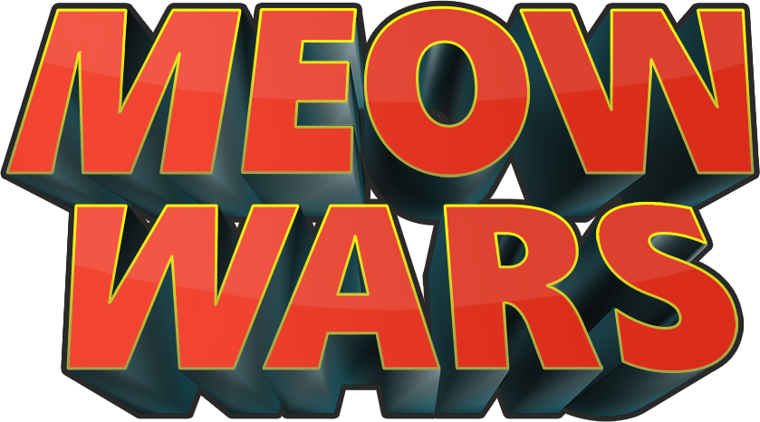

<picture>
  
</picture>

### Indie studio. Big-studio experience.

---

## About

**Taco Truck Games** is an independent game studio based in Seattle, WA, founded in 2016 by **Adrian Sotomayor** — a 25+ year industry veteran who has shipped titles including **Minecraft**, **Hearthstone**, **Among Us**, and **Risk of Rain 2**.

We focus on fun, quick-to-play games across mobile and PC.

---

## Games

<table>
<tr>
<td align="center" width="50%">

 

**Crystal Dig: Gem Miner** (2025) 
Block puzzle adventure — mine gems, battle bosses, and dig through 50 handcrafted levels across 5 crystal caverns.  

</td>
<td align="center" width="50%">

 

**Meow Wars: Card Battle** (2018) 
Strategic card battle game featuring adorable cats. Battle through a campaign, challenge friends to PVP duels, and free Claw Mountain!  

</td>
</tr>
<tr>
<td align="center" width="50%">

 

**Stop Santa: Tower Defense** (2017) 
Santa has gone rogue! Build holiday-themed towers, defend the North Pole, and stop his elf army across a frozen tundra.  

</td>
<td align="center" width="50%">

   

### More games coming soon...

   

</td>
</tr>
</table>

---

## Featured Open Source

<table>
<tr>
<td>

### [EOS Plugin for Unity](https://github.com/EOS-Contrib/eos_plugin_for_unity)

Epic Online Services integration for Unity — bringing free cross-platform player services to Unity developers.

- **25+ EOS services** — achievements, lobbies, P2P, voice chat, matchmaking & more
- **9+ platforms** — Windows, Mac, Linux, Android, iOS, Switch, Xbox, PlayStation
- **4,300+ commits** across 47 releases

</td>
</tr>
</table>

---

## Tech Stack

---

**[tacotruckgames.com](http://www.tacotruckgames.com)** · **[Adrian@TacoTruckGames.com](mailto:Adrian@TacoTruckGames.com)** · **Seattle, WA**

